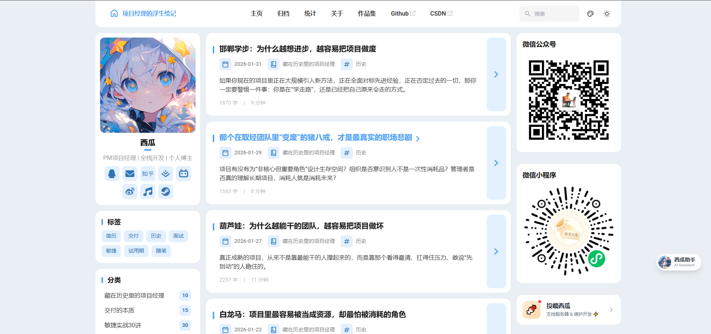
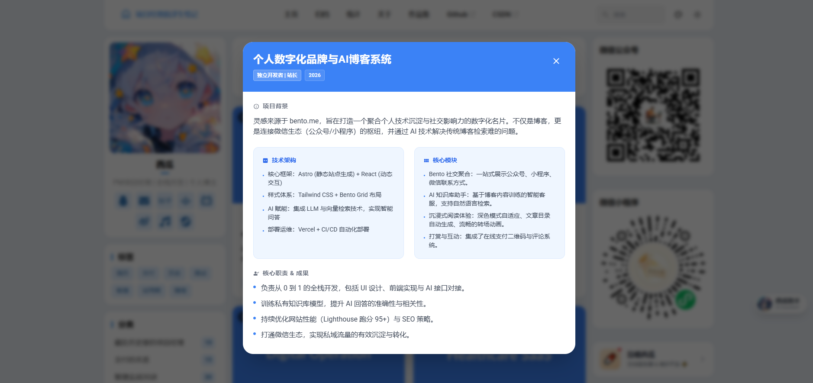
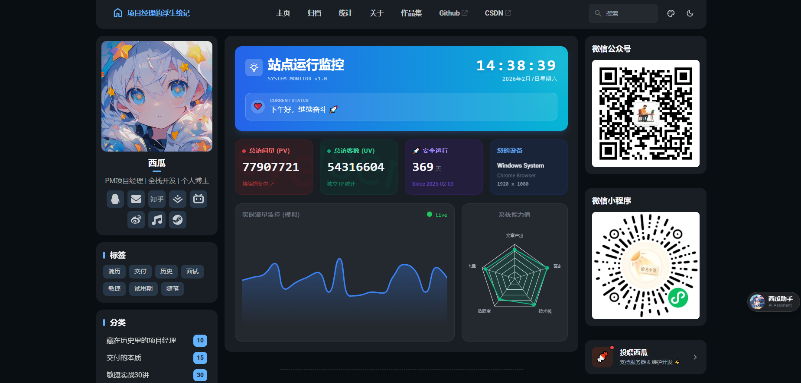

# Shenwan Blog

> 一个基于 Astro & Tailwind CSS 构建的现代化个人数字化名片与技术博客。 融合 **Bento 风格设计**、**AI 智能助手** 与 **沉浸式项目作品集**。

**[在线预览 Live Demo](shenwan.life)** | **[报告 Bug](https://github.com/ShenWan0906/ShenWan0906/issues)**

* * *

## ✨ 核心亮点 (Features)

这个博客不仅仅是文章的堆砌，更是一个全栈技术的演练场与个人品牌的数字化枢纽。

### 🎨 1. Bento 风格与极简设计

灵感来源于 `bento.me`，采用网格化布局聚合信息。

-   **清爽蓝白配色**：科技感与阅读舒适度并存，适配深色模式（Dark Mode）。
-   **响应式布局**：完美适配 PC、平板与移动端。

### 🤖 2. AI 赋能 (AI-Powered)

这不是一个静态网站，它拥有“大脑”。

-   **私有知识库助手**：基于 RAG 技术，训练了我的个人技术文档与博客内容。
-   **智能问答**：访客可以通过右下角悬浮球与 AI 对话，快速检索我的技术栈与过往经历。

### 💼 3. 交互式项目作品集 (Portfolio)

告别枯燥的列表，用更优雅的方式展示职业生涯。

-   **卡片式预览**：高度概括的项目摘要与视觉封面。
-   **详情弹窗 (Modal)** ：点击卡片弹出深度解析，包含技术架构、核心模块与个人职责，支持长内容滚动。
-   **原生质感**：使用 Astro Island 架构与原生 Dialog 标签实现，性能极致。

### 📱 4. 社交矩阵聚合

打破信息孤岛，将我的全网影响力汇聚一处。

-   集成 **微信公众号** 与 **微信小程序** 二维码。
-   侧边栏动态展示，文章阅读页自动隐藏以专注内容。

* * *

## 🛠️ 技术栈 (Tech Stack)

-   **核心框架**: [Astro](https://astro.build/) (SSG + SSR)
-   **样式库**: [Tailwind CSS](https://tailwindcss.com/)
-   **UI 组件**: React (用于复杂交互), Astro Components
-   **图标库**: Iconify (Material Symbols Rounded)
-   **主题基底**: 基于 [Fuwari](https://github.com/saicaca/fuwari) 深度定制
-   **部署**: Vercel / Docker

* * *

## 📸 截图预览 (Screenshots)

### 首页与 Bento 布局


### 项目作品集 (Modal 弹窗)


### 深色模式 (Dark Mode)

* * *

## 🚀 本地运行 (Getting Started)

如果你也想部署一个类似的博客，或者参与贡献，请按照以下步骤操作：

### 1. 克隆仓库

Bash

```
git clone https://github.com/ShenWan0906/shenwan-blog.git
cd shenwan-blog
```

### 2. 安装依赖

推荐使用 `pnpm` 以获得最快的安装速度：

Bash

```
pnpm install
```

### 3. 启动开发服务器

Bash

```
pnpm dev
```

打开浏览器访问 `http://localhost:4321` 即可看到效果。

### 4. 构建生产版本

Bash

```
pnpm build
```

* * *

## 📂 项目配置 (Configuration)

主要的个性化配置位于 `src/config.ts` 和 `src/constants/` 目录下：

-   `src/config.ts`: 站点基础信息（标题、描述、社交链接）。
-   `src/constants/projects.ts`: **项目作品集数据**（修改这里的 JSON 即可更新你的项目经历）。
-   `src/components/`: 自定义组件源码。

* * *

## 🤝 贡献与支持 (Contribution)

如果你喜欢这个项目，欢迎点击右上角的 **⭐️ Star** 支持一下！

如果你发现了 Bug 或有新的想法，欢迎提交 [Issue](https://www.google.com/search?q=https://github.com/%E4%BD%A0%E7%9A%84%E7%94%A8%E6%88%B7%E5%90%8D/%E4%BD%A0%E7%9A%84%E4%BB%93%E5%BA%93%E5%90%8D/issues) 或 Pull Request。

* * *

## 📄 开源协议 (License)

本项目基于 MIT 协议开源。 部分设计与代码基于 [Fuwari](https://github.com/saicaca/fuwari) 主题，感谢原作者的开源贡献。

* * *

<div align="center"> <p>Made with ❤️ by <b>Shenwan</b></p> <p>👇 扫码关注我的公众号 👇</p>  </div>